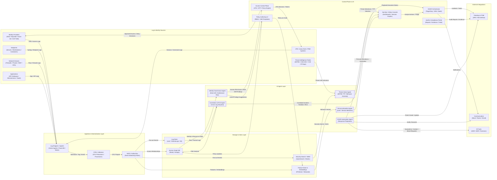
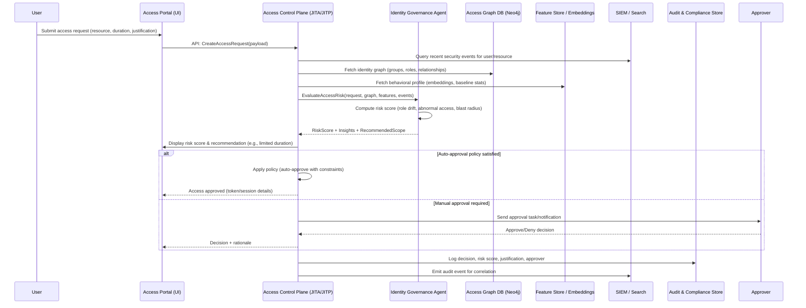
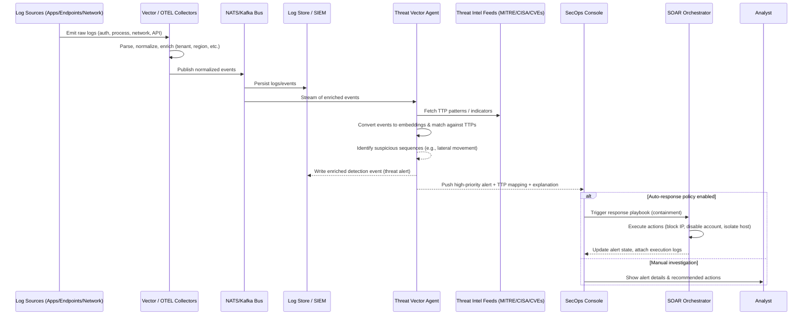
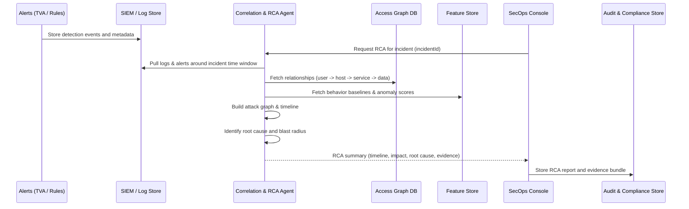
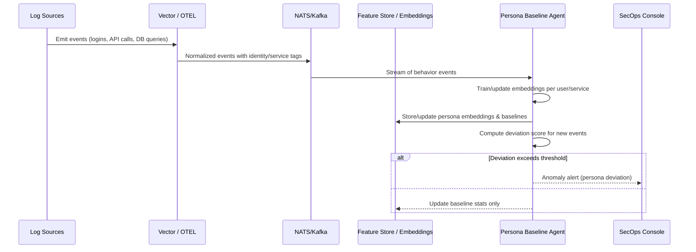
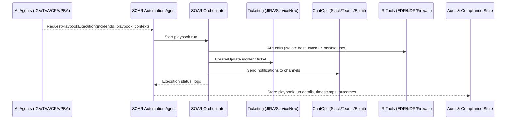

# AI-Augmented IT Log Management Platform
## Architecture & Agent Flows (Access Management & Threat Vectors)

This document describes an end-to-end architecture for an AI-augmented IT log management platform focused on:

- Identity & access management (IAM, JITA/JITP, PAM)
- Threat vector detection (MITRE ATT&CK, behavioral analytics)
- Correlation & RCA
- SOAR-style automated response

It is structured as:

1. High-level architecture (Mermaid flowchart)
2. Component breakdown
3. Per-agent views with detailed sequence diagrams
4. Integration notes (Vector.dev, OTEL, NATS/Kafka, storage, control plane)

---

## 1. High-Level Architecture (Mermaid)

---

## 2. Component Breakdown

### 2.1 Log & Identity Sources

- **Identity Providers**: Okta, Keycloak, Azure AD, GCP IAM.
- **JITA / PAM Systems**: Jump hosts, bastion, privileged access management tools.
- **Endpoints**: Linux/Windows servers, workstations, containers, Kubernetes nodes.
- **Network Devices**: Firewalls, WAF, VPN, load balancers, proxies.
- **Applications**: API gateways, internal microservices, SaaS audit logs.
- **Threat Intelligence**: MITRE ATT&CK mappings, CISA KEV, curated CVEs, IP/domain reputation.

### 2.2 Ingestion & Normalization Layer

- **Log Shippers/Agents**: Vector agents, Fluent Bit, Beats; responsible for collecting logs and forwarding to OTEL or central pipeline.
- **OTEL Collectors**: OTLP receivers and processors, performing transformations, sampling, redaction, and routing.
- **NATS / Kafka Event Bus**: Central fan-out fabric for normalized events, decoupling producers and consumers.

### 2.3 Storage & Index Layer

- **Log Store**: Loki/VictoriaLogs/S3 for time-series and raw/parsed log retention.
- **Security Search / SIEM**: OpenSearch/Elastic for structured search and rule-based detections.
- **Access Graph DB**: Neo4j/Arango to represent identities, roles, resources, and permissions as graphs.
- **Feature Store & Embeddings**: PGVector/Weaviate storing user/service behavior embeddings, TTP embeddings, and derived features.

### 2.4 AI Agent Layer

- **Identity Governance Agent (IGA)**: Role drift detection, entitlement risk scoring, least-privilege suggestions.
- **Threat Vector Agent (TVA)**: MITRE TTP mapping, anomaly detection, suspicious pattern detection.
- **Correlation & RCA Agent (CRA)**: Cross-log correlation, attack-path reconstruction, incident storyline/RCA.
- **Persona Baseline Agent (PBA)**: Behavioral baselines for users and services, deviation detection.
- **SOAR Automation Agent (SAA)**: Executes response playbooks (quarantine, key rotation, ticketing, notifications).

### 2.5 Control Plane & UX

- **Access Control Plane**: JITA/JITP engine, policy enforcement, token/session issuance, approvals.
- **SecOps / AIOps Console**: Dashboards, session graphs, risk views, investigation UI.
- **Policy Authoring UI**: RBAC/IAM policy editor, policy-as-code workflows.
- **SOAR Orchestrator**: Integrates with PagerDuty, JIRA, Slack, Teams; executes automation flows.
- **Audit & Compliance Portal**: Displays audit trails, evidence, compliance reports.

### 2.6 External Integrations

- **Ticketing & ITSM**: JIRA, ServiceNow, etc.
- **Communication Channels**: Slack, Teams, email.
- **IR Tools**: EDR/NDR/forensics platforms for deeper investigation and containment.

---

## 3. Per-Agent Views & Sequence Diagrams

The following sections slice the architecture by agent and provide detailed sequence diagrams for the main flows.

---

### 3.1 Identity Governance Agent (IGA) Flow

**Use case:** User requests privileged access; agent scores risk based on identity & behavior; control plane decides approve/deny and logs actions.

**Key IGA responsibilities:**

- Combine **graph context** (who can access what) with **behavioral context** (what they usually do).
- Detect **role drift**, over-privileged users, and suspicious resource targeting.
- Return **risk score, explanation, and recommended scope (role/time restriction)**.

---

### 3.2 Threat Vector Agent (TVA) Flow

**Use case:** Logs indicate suspicious behavior; TVA maps to MITRE TTPs and raises a threat alert with enriched context.

**Key TVA responsibilities:**

- Map event patterns to **MITRE ATT&CK techniques**, using embeddings and rules.
- Identify **multi-step attack patterns** (e.g., persistence → lateral movement → exfil).
- Provide **explainable threat alerts** with TTP labels and recommended remediation.

---

### 3.3 Correlation & RCA Agent (CRA) Flow

**Use case:** Multiple alerts and logs exist; CRA builds a timeline and narrative of the incident, linking identity, network, and application layers.

**Key CRA responsibilities:**

- Correlate **signals from multiple agents + raw logs**.
- Build human-readable **storyline and timeline**.
- Estimate **blast radius** and impacted entities.

---

### 3.4 Persona Baseline Agent (PBA) Flow

**Use case:** Continuous learning of normal behavior for users/services; raise deviations for identity or service misuse.

**Key PBA responsibilities:**

- Maintain **per-identity and per-service embeddings**.
- Detect **anomalous usage** independent of static policy.
- Feed anomaly scores into IGA, TVA, and CRA.

---

### 3.5 SOAR Automation Agent (SAA) Flow

**Use case:** On high-confidence threats or policy violation, SAA executes playbooks: isolation, revocation, ticketing, notification.

**Key SAA responsibilities:**

- Provide **policy-aware automation**, gated by risk & confidence.
- Integrate with **IR tools, ticketing, ChatOps**.
- Maintain **audit trails** for all automated actions.

---

## 4. Integration Notes (Vector.dev, OTEL, Backend)

At a platform level:

- **Vector.dev agents**: Ship logs from identity providers, PAM/jump hosts, endpoints, and network gear.
- **OTEL collectors**: Serve as a central pipeline: OTLP ingest, enrichment, redaction, multi-tenant routing.
- **Event bus (NATS/Kafka)**: Decouple log ingestion from AI agents and storage.
- **Python backend**: Expose API endpoints for UI, house AI agent orchestrators and models, and integrate with Vector/OTEL via HTTP/gRPC/OTLP.
- **React UI**: Implements dashboards, RCA views, policy editors, and JITA/JITP workflows on top of backend APIs.
- **Storage**: Use a mix of time-series/log databases, graph DB, and vector stores for the agents’ needs.

This .md file can be used as the core design spec in a repo (e.g., `/docs/ai-log-platform-architecture.md`).
