# FlowGate Architecture Diagram

## System Architecture Overview

This document provides a comprehensive architecture diagram of the FlowGate observability optimization platform.

## Complete System Architecture

```mermaid
graph TB
    subgraph "User Interface Layer"
        UI[React Frontend<br/>Port: 5173<br/>- Dashboard<br/>- Template Management<br/>- Deployment Management<br/>- Agent Management<br/>- Log Transformer<br/>- Supervisor UI]
    end

    subgraph "Control Plane - Backend Services"
        Backend[FastAPI Backend<br/>Port: 8000<br/>- REST API<br/>- Template Service<br/>- Deployment Service<br/>- Gateway Service<br/>- Validation Service<br/>- Settings Service]
        
        OpAMPServer[OpAMP Server<br/>Port: 4320<br/>- OpAMP Protocol Handler<br/>- WebSocket Transport<br/>- HTTP Transport<br/>- Config Distribution]
        
        BackendRouters[API Routers<br/>- /templates<br/>- /deployments<br/>- /gateways<br/>- /opamp-config<br/>- /validation<br/>- /registration-tokens<br/>- /supervisor<br/>- /settings]
    end

    subgraph "Data Storage Layer"
        Postgres[(PostgreSQL<br/>Port: 5432<br/>- Templates<br/>- Deployments<br/>- Gateways<br/>- Users/Orgs<br/>- Audit Logs<br/>- Settings)]
        
        Redis[(Redis<br/>Port: 6379<br/>- Caching<br/>- Session Storage)]
    end

    subgraph "Data Plane - Gateway"
        Gateway[FlowGate Gateway<br/>Ports: 4317, 4318, 8888]
        
        subgraph "Gateway Components"
            Supervisor[OpAMP Supervisor<br/>v0.139.0<br/>- Lifecycle Management<br/>- Local OpAMP Server<br/>Port: 4321]
            
            Collector[OTel Collector<br/>v0.130.0<br/>- Custom Build<br/>- OpAMP Extension<br/>- OTLP Receiver<br/>- Prometheus Receiver<br/>- Transform Processors<br/>- OTLP Exporters]
            
            Heartbeat[Heartbeat Service<br/>- Status Reporting<br/>- Health Checks]
        end
        
        GatewayConfig[Gateway Configs<br/>- Base Config<br/>- Supervisor Config<br/>- Remote Configs]
    end

    subgraph "External Agents"
        Agents[Observability Agents<br/>- Prometheus<br/>- OTLP Agents<br/>- FluentBit<br/>- Custom Agents]
    end

    subgraph "Backend Destinations"
        Backends[Observability Backends<br/>- Datadog<br/>- GCP Monitoring<br/>- Grafana<br/>- Prometheus/Mimir<br/>- Vector<br/>- Custom Backends]
    end

    %% UI to Backend connections
    UI -->|HTTP REST API| Backend
    UI -->|WebSocket| Backend

    %% Backend internal connections
    Backend --> BackendRouters
    Backend --> Postgres
    Backend --> Redis
    Backend --> OpAMPServer

    %% OpAMP Protocol connections
    OpAMPServer -->|OpAMP Protocol<br/>WebSocket/HTTP| Supervisor
    Supervisor -->|Local OpAMP<br/>ws://localhost:4321/v1/opamp| Collector
    Collector -->|OpAMP Extension| Supervisor

    %% Gateway internal connections
    Supervisor --> Collector
    Supervisor --> Heartbeat
    Supervisor --> GatewayConfig
    Collector --> GatewayConfig

    %% Data flow from agents
    Agents -->|OTLP gRPC :4317<br/>OTLP HTTP :4318<br/>Prometheus| Collector

    %% Data flow to backends
    Collector -->|OTLP gRPC/HTTP<br/>Optimized Telemetry| Backends

    %% Management flow
    Backend -->|Config Distribution<br/>via OpAMP| OpAMPServer
    Heartbeat -->|HTTP POST<br/>Status Updates| Backend
    Supervisor -->|OpAMP Status<br/>Health Reports| OpAMPServer

    %% Styling
    classDef ui fill:#e1f5ff,stroke:#01579b,stroke-width:2px
    classDef backend fill:#f3e5f5,stroke:#4a148c,stroke-width:2px
    classDef storage fill:#fff3e0,stroke:#e65100,stroke-width:2px
    classDef gateway fill:#e8f5e9,stroke:#1b5e20,stroke-width:2px
    classDef external fill:#fce4ec,stroke:#880e4f,stroke-width:2px

    class UI ui
    class Backend,OpAMPServer,BackendRouters backend
    class Postgres,Redis storage
    class Gateway,Supervisor,Collector,Heartbeat,GatewayConfig gateway
    class Agents,Backends external
```



## Detailed Component Architecture

### 1. Frontend Layer

```
┌─────────────────────────────────────────────────────────┐
│              React Frontend (Port 5173)                  │
├─────────────────────────────────────────────────────────┤
│  Pages:                                                  │
│  - Dashboard (Agent status, metrics)                    │
│  - Templates (Create, version, manage templates)      │
│  - Deployments (Deploy configs to agents)               │
│  - Agent Management (View, manage agents)              │
│  - OpAMP Config Management                              │
│  - Log Transformer (AI-assisted log transformation)    │
│  - Settings (System configuration)                      │
│                                                          │
│  Components:                                            │
│  - AgentStatusBadge, OpAMPStatusBadge                   │
│  - SupervisorConfigEditor, SupervisorStatus             │
│  - AgentConfigViewer, CapabilitiesDisplay               │
└─────────────────────────────────────────────────────────┘
```

### 2. Backend API Layer

```
┌─────────────────────────────────────────────────────────┐
│         FastAPI Backend (Port 8000)                     │
├─────────────────────────────────────────────────────────┤
│  Routers:                                               │
│  - /api/v1/templates (CRUD operations)                │
│  - /api/v1/deployments (Config deployments)            │
│  - /api/v1/gateways (Gateway registration/management)  │
│  - /api/v1/opamp-config (OpAMP config management)     │
│  - /api/v1/validation (Config validation)               │
│  - /api/v1/registration-tokens (Token management)      │
│  - /api/v1/supervisor (Supervisor management)          │
│  - /api/v1/supervisor/agents (Supervisor UI)           │
│  - /api/v1/settings (System settings)                   │
│  - /api/v1/agent-tags (Tag management)                  │
│                                                          │
│  Services:                                              │
│  - TemplateService (Template CRUD, versioning)         │
│  - DeploymentService (Deployment orchestration)        │
│  - GatewayService (Gateway lifecycle)                   │
│  - OpAMPService (OpAMP token management)                │
│  - OpAMPProtocolService (OpAMP message handling)        │
│  - OpAMPConfigService (Config distribution)            │
│  - ValidationService (Config validation)                │
│  - ConfigValidator (Component validation)               │
│  - SettingsService (System settings)                     │
└─────────────────────────────────────────────────────────┘
```

### 3. OpAMP Server

```
┌─────────────────────────────────────────────────────────┐
│         OpAMP Server (Port 4320)                         │
├─────────────────────────────────────────────────────────┤
│  Endpoints:                                              │
│  - /api/v1/opamp/v1/opamp (WebSocket)                   │
│  - /api/v1/opamp/v1/opamp (HTTP POST)                   │
│                                                          │
│  Features:                                              │
│  - WebSocket transport (preferred)                      │
│  - HTTP transport (polling)                            │
│  - Token-based authentication                        │
│  - Capability negotiation                               │
│  - Remote config distribution                           │
│  - Health status tracking                               │
│  - Effective config reporting                           │
└─────────────────────────────────────────────────────────┘
```

### 4. Gateway Architecture (Dual Mode)

```
┌─────────────────────────────────────────────────────────┐
│              FlowGate Gateway Container                  │
├─────────────────────────────────────────────────────────┤
│                                                          │
│  ┌──────────────────────────────────────────────────┐  │
│  │         Mode 1: Supervisor Mode (Default)        │  │
│  ├──────────────────────────────────────────────────┤  │
│  │                                                  │  │
│  │  OpAMP Supervisor (v0.139.0)                    │  │
│  │  ├─ Connects to: ws://backend:8000/.../opamp    │  │
│  │  ├─ Local Server: ws://localhost:4321/v1/opamp │  │
│  │  ├─ Manages: Collector lifecycle                │  │
│  │  ├─ Features:                                    │  │
│  │  │  - Auto-restart on failure                   │  │
│  │  │  - Enhanced status reporting                 │  │
│  │  │  - Log management                            │  │
│  │  │  - Remote config application                 │  │
│  │  └─ Storage: /var/lib/opampsupervisor          │  │
│  │                                                  │  │
│  │         ┌──────────────────────┐                │  │
│  │         │  OTel Collector      │                │  │
│  │         │  (v0.130.0)           │                │  │
│  │         │  ├─ OpAMP Extension   │                │  │
│  │         │  │  └─ Connects to    │                │  │
│  │         │  │     supervisor     │                │  │
│  │         │  ├─ OTLP Receiver     │                │  │
│  │         │  ├─ Prometheus Rx     │                │  │
│  │         │  ├─ Processors        │                │  │
│  │         │  └─ Exporters         │                │  │
│  │         └──────────────────────┘                │  │
│  │                                                  │  │
│  └──────────────────────────────────────────────────┘  │
│                                                          │
│  ┌──────────────────────────────────────────────────┐  │
│  │         Mode 2: Direct Extension Mode            │  │
│  ├──────────────────────────────────────────────────┤  │
│  │                                                  │  │
│  │  OTel Collector (v0.130.0)                      │  │
│  │  ├─ OpAMP Extension                              │  │
│  │  │  └─ Connects directly to:                    │  │
│  │  │     ws://backend:8000/.../opamp              │  │
│  │  ├─ OTLP Receiver                                │  │
│  │  ├─ Prometheus Receiver                          │  │
│  │  ├─ Processors                                   │  │
│  │  └─ Exporters                                   │  │
│  │                                                  │  │
│  │  Heartbeat Service                               │  │
│  │  └─ HTTP POST to backend                        │  │
│  │                                                  │  │
│  └──────────────────────────────────────────────────┘  │
│                                                          │
└─────────────────────────────────────────────────────────┘
```

## Data Flow Diagrams

### 1. Gateway Registration Flow

```
┌──────────┐      ┌──────────┐      ┌──────────┐      ┌──────────┐
│ Gateway  │      │ Backend  │      │Database  │      │  OpAMP   │
│          │      │          │      │          │      │  Server  │
└────┬─────┘      └────┬─────┘      └────┬─────┘      └────┬─────┘
     │                 │                 │                 │
     │ 1. POST /gateways│                 │                 │
     │    (with token)  │                 │                 │
     ├─────────────────>│                 │                 │
     │                 │                 │                 │
     │                 │ 2. Validate     │                 │
     │                 │    token       │                 │
     │                 ├─────────────────>│                 │
     │                 │                 │                 │
     │                 │ 3. Create       │                 │
     │                 │    gateway      │                 │
     │                 │    record       │                 │
     │                 ├─────────────────>│                 │
     │                 │                 │                 │
     │                 │ 4. Generate      │                 │
     │                 │    OpAMP token  │                 │
     │                 │                 │                 │
     │ 5. Return       │                 │                 │
     │    OpAMP token  │                 │                 │
     │    & endpoint   │                 │                 │
     │<─────────────────┤                 │                 │
     │                 │                 │                 │
     │ 6. Connect via   │                 │                 │
     │    OpAMP         │                 │                 │
     ├─────────────────────────────────────────────────────>│
     │                 │                 │                 │
```

### 2. Configuration Deployment Flow

```
┌──────────┐      ┌──────────┐      ┌──────────┐      ┌──────────┐
│   UI     │      │ Backend  │      │Database  │      │ Gateway  │
│          │      │          │      │          │      │          │
└────┬─────┘      └────┬─────┘      └────┬─────┘      └────┬─────┘
     │                 │                 │                 │
     │ 1. Create       │                 │                 │
     │    deployment   │                 │                 │
     ├─────────────────>│                 │                 │
     │                 │                 │                 │
     │                 │ 2. Validate     │                 │
     │                 │    config        │                 │
     │                 │                 │                 │
     │                 │ 3. Store        │                 │
     │                 │    deployment   │                 │
     │                 ├─────────────────>│                 │
     │                 │                 │                 │
     │                 │ 4. Push config  │                 │
     │                 │    via OpAMP    │                 │
     │                 ├─────────────────────────────────────>│
     │                 │                 │                 │
     │                 │ 5. Gateway      │                 │
     │                 │    applies      │                 │
     │                 │    config       │                 │
     │                 │<─────────────────────────────────────┤
     │                 │                 │                 │
     │ 6. Update status │                 │                 │
     │<─────────────────┤                 │                 │
     │                 │                 │                 │
```

### 3. Telemetry Processing Flow

```
┌──────────┐      ┌──────────┐      ┌──────────┐
│ Agents   │      │ Gateway  │      │ Backends │
│          │      │          │      │          │
└────┬─────┘      └────┬─────┘      └────┬─────┘
     │                 │                 │
     │ 1. Send         │                 │
     │    telemetry    │                 │
     │    (OTLP/Prom)  │                 │
     ├─────────────────>│                 │
     │                 │                 │
     │                 │ 2. Receive      │
     │                 │    & validate   │
     │                 │                 │
     │                 │ 3. Apply        │
     │                 │    transforms   │
     │                 │    (drop,       │
     │                 │     filter,     │
     │                 │     transform)  │
     │                 │                 │
     │                 │ 4. Route to     │
     │                 │    backends    │
     │                 ├─────────────────>│
     │                 │                 │
```

### 4. Supervisor Mode Communication Flow

```
┌─────────────────────────────────────────────────────────┐
│                    Gateway Container                     │
├─────────────────────────────────────────────────────────┤
│                                                          │
│  ┌──────────────┐         ┌──────────────┐              │
│  │  Supervisor  │         │  Collector   │              │
│  │              │         │              │              │
│  │ 1. Start     │         │              │              │
│  │    local     │         │              │              │
│  │    OpAMP     │         │              │              │
│  │    server    │         │              │              │
│  │    :4321     │         │              │              │
│  │              │         │              │              │
│  │ 2. Connect   │         │              │              │
│  │    to backend│         │              │              │
│  │    OpAMP     │         │              │              │
│  │    server    │         │              │              │
│  │              │         │              │              │
│  │ 3. Launch    │────────>│ 4. Start     │              │
│  │    collector │         │    collector │              │
│  │              │         │              │              │
│  │              │<────────│ 5. Connect   │              │
│  │              │         │    to local  │              │
│  │              │         │    OpAMP     │              │
│  │              │         │    server    │              │
│  │              │         │              │              │
│  │ 6. Proxy     │         │              │              │
│  │    OpAMP     │         │              │              │
│  │    messages  │         │              │              │
│  │              │         │              │              │
│  └──────────────┘         └──────────────┘              │
│                                                          │
└─────────────────────────────────────────────────────────┘
```

## Component Versions

- **Frontend**: React + TypeScript + Vite
- **Backend**: FastAPI (Python 3.11+)
- **OpAMP Supervisor**: v0.139.0
- **OTel Collector**: v0.130.0 (custom build)
- **Database**: PostgreSQL 15
- **Cache**: Redis 7

## Network Ports

| Service | Port | Protocol | Purpose |
|---------|------|----------|---------|
| Frontend | 5173 | HTTP | React dev server |
| Backend | 8000 | HTTP | REST API |
| OpAMP Server | 4320 | WebSocket/HTTP | OpAMP protocol |
| Gateway OTLP gRPC | 4317 | gRPC | Telemetry ingress |
| Gateway OTLP HTTP | 4318 | HTTP | Telemetry ingress |
| Gateway Metrics | 8888 | HTTP | Health/metrics |
| Supervisor Local | 4321 | WebSocket | Local OpAMP server |
| PostgreSQL | 5432 | TCP | Database |
| Redis | 6379 | TCP | Cache |

## Security Architecture

```
┌─────────────────────────────────────────────────────────┐
│                    Security Layers                      │
├─────────────────────────────────────────────────────────┤
│                                                          │
│  1. Registration Token (JWT)                            │
│     - One-time use for gateway registration             │
│     - Scoped to organization                            │
│                                                          │
│  2. OpAMP Token (JWT)                                    │
│     - Long-lived (365 days default)                     │
│     - Used for OpAMP protocol authentication            │
│     - Sent in Authorization header or query param      │
│                                                          │
│  3. Multi-Tenancy                                        │
│     - All resources scoped by org_id                    │
│     - Isolated configurations per organization          │
│                                                          │
│  4. Config Validation                                   │
│     - Component whitelist validation                     │
│     - YAML syntax validation                            │
│     - Structure validation                              │
│                                                          │
└─────────────────────────────────────────────────────────┘
```

## Deployment Architecture

### Local Development (Docker Compose)
- All services in single compose file
- Hot-reload enabled for development
- Volume mounts for live code updates

### Production (Kubernetes + Helm)
- Helm charts in `helm/flowgate/`
- Separate values files (dev/staging/prod)
- Horizontal scaling support
- Persistent volumes for data

## Key Features

1. **Dual Mode Support**
   - Supervisor mode: Enhanced lifecycle management
   - Extension mode: Direct OpAMP connection

2. **Remote Configuration**
   - OpAMP protocol for config distribution
   - Versioned deployments
   - Rollback support

3. **Component Validation**
   - Validates configs against available components
   - Prevents unsupported component usage
   - Ensures compatibility

4. **Multi-Tenancy**
   - Organization-scoped resources
   - Isolated configurations
   - Per-org settings

